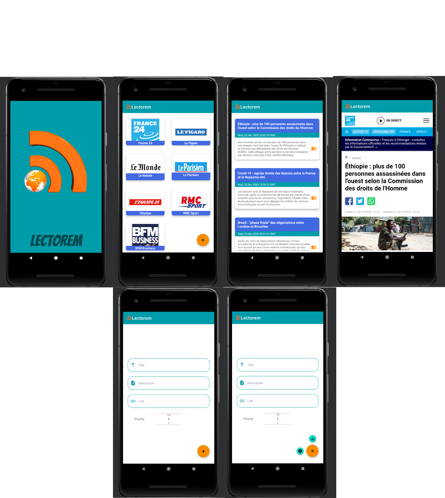

# Lectorem


## Welcome to **Lectorem** !

### RSS Reader application

It’s fast and clean, giving you the freedom to enjoy your favorite news. !

## Features

*	Subscribing to feeds
*	Renaming feeds (not provided yet, available in major version)
*	Scrolling feeds
*   Deleting or unsubscribing to an individual feed (by swiping left/right)
*	Scrolling news from selected feed
*	Full-screen mode for articles from news

## Platforms

Lectorem is compatible with all the devices which use as Operating System :

*   Android OS

## Requirements

Lectorem is designed too have fairly minimal requirements to build and use with your projects, but there are somes. If you notice any problems on your platform, please notify [`Hethsron Jedaël BOUEYA`](mailto:hetshron-jeadel.boueya@uha.fr). Patches and fixing them for welcome !

## Development
For developement, before running the application, you need to clone this project on your local repository, open it with Android Studio and Build Apps as follows :

1. Clone the `lectorem` repo locally :

    ```console
        $ git clone https://github.com/Hethsron/lectorem.git
    ```

2. Open this project With Android Studio :

3. Build Apps :

	
